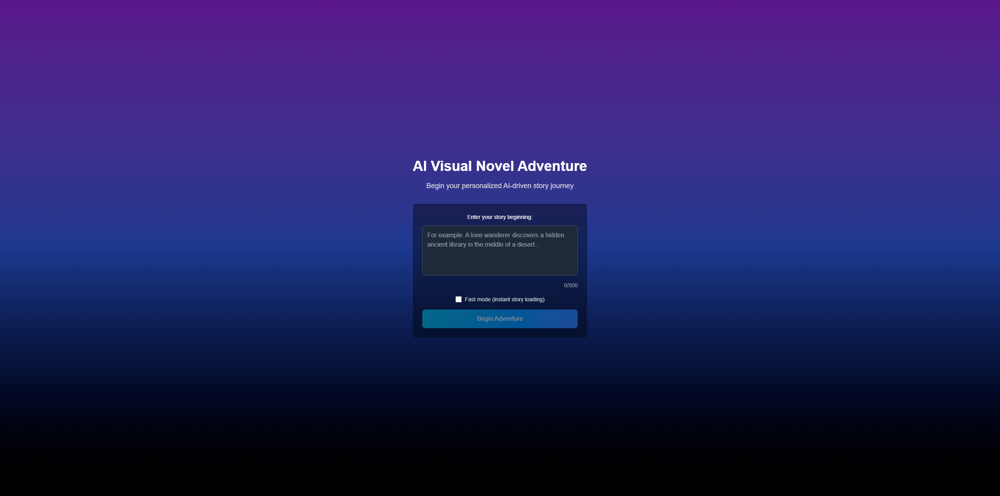
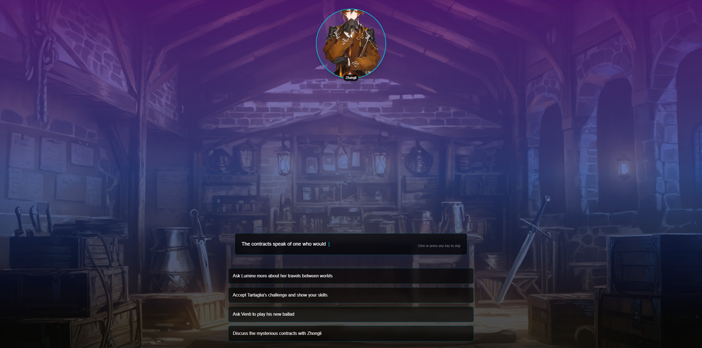
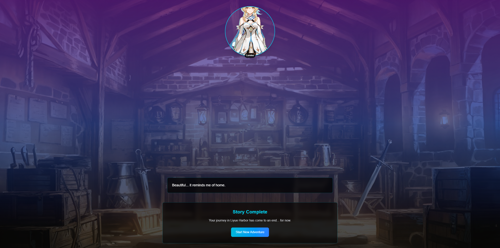

# AI-Powered Visual Novel (Next.js + TypeScript)

This repository is my take‑home assignment for the Full‑Stack Engineer (Next.js) position. The goal is to implement a web-based, interactive visual novel where the story is streamed from a mock LLM in structured XML and rendered with a typing effect, dynamic character avatars, and interactive choices.

The README is written to help reviewers validate that every required point in the assignment has been implemented (Bonus Points excluded).

---

## At a Glance (Requirements Fit)

- Story initiation from a user prompt: implemented in the landing screen input and start button
- Streaming text with typing effect: implemented via a streaming API and a Typewriter component
- Dynamic character avatars: implemented with emotion-driven portrait swapping per segment
- Interactive choices after each story segment: implemented; choices branch the narrative
- App Router + Next.js Route Handlers: implemented for the streaming API
- TypeScript + modern styling (Tailwind CSS): implemented
- Real-time structured XML parsing focus: implemented with a robust parser and streaming pipeline

---

## Demo Journey (How to Verify the Requirements Quickly)

1) Start the app and enter any opening prompt (e.g., "I step inside Wanmin Restaurant.").
- You will see a polished landing page with a prompt input and a "Begin Adventure" button.



2) After submitting, the story streams from the backend.
- A typing effect renders the text character-by-character.
- The speaking character’s avatar shows and changes expressions based on XML cues.


3) At the end of the streamed segment, clickable choices appear.
- Choosing an option triggers the next streamed segment and continues the story.
- The assignment’s fixed XML is used, so there are multiple rounds and clean story completion.



4) You can optionally enable "Fast mode (instant story loading)" on the landing screen to load segments immediately (useful for reviewing functionality quickly).

---

## Technical Stack

- Framework: Next.js (App Router, Next 15)
- Language: TypeScript
- Styling: Tailwind CSS
- Backend: Next.js Route Handlers (Edge-style streaming via ReadableStream)
- UI: React (functional components and hooks)

---

## Architecture Overview

- Frontend
  - `src/components/VisualNovel.tsx`: Orchestrates story flow, renders avatars, text, and choices
  - `src/components/TypingText.tsx`: Typing effect with skip support (click or keyboard)
  - `src/components/CharacterAvatar.tsx`: Emotion-driven avatar swapping with smooth transitions
  - `src/lib/xmlParser.ts`: XML parsing utilities (regex-based simplified parser + streaming parser class)

- Backend
  - `src/app/api/story/route.ts`: Route Handler that streams line-delimited JSON events
    - `{"type":"content","data":"<xml-chunk>"}` repeated
    - `{"type":"complete","choices":[...]} ` once per segment
  - Streams characters in performant chunks to simulate networked LLM output

- Assets
  - `public/assets/sample.xml`: Provided fixed XML used to mock LLM output
  - `public/characters/*`: Portraits per character and emotion (e.g., `/Lumine/Happy.png`)

---

## How Each Requirement Is Met

- User Experience & Features
  - Story Initiation: users enter a short prompt on the landing screen and start the story
  - Streaming Text with Typing Effect: the backend streams the story; the frontend renders with a typewriter effect
  - Dynamic Character Avatars: the current speaker’s avatar is shown; expressions change via XML `action expression` data
  - Interactive Choices: clickable options are displayed at the end of each segment; selecting a choice continues the story

- Technical Stack
  - Next.js (App Router) + Route Handlers for the server-side logic
  - TypeScript everywhere (types for segments, choices, characters, parser)
  - Tailwind CSS for a responsive, visually polished UI

- LLM Output Parsing (Key Challenge)
  - The app focuses on structured XML parsing and streaming.
  - A simplified, production-ready regex parser (`parseSimpleXML`) extracts narrator text, character names, dialogue, and expressions from the provided XML format.
  - A streaming parser class (`XMLStreamParser`) is also included to progressively parse partial XML if a true real-time progressive UI is desired.
  - The backend mocks an LLM by streaming XML characters in chunks; the frontend accumulates and parses reliably.
  - Partial/invalid XML is handled gracefully by accumulating until a coherent segment can be parsed.

---

## Implementation Details

- Streaming API Protocol
  - The API streams line-delimited JSON objects:
    - `type: "content"` events carry XML chunks
    - A final `type: "complete"` event carries the choice list for the next step
  - Chunks are sized to feel responsive yet performant; an optional "Fast mode" sends the entire content immediately for rapid review.

- Typing Effect
  - `TypingText` renders characters with a controlled interval
  - Users can click or press any key to skip

- Dynamic Avatars
  - Avatars are chosen by `CharacterName` and emotion
  - A robust map normalizes emotion names (e.g., `very_happy` → `Very Happy`)
  - Smooth transitions make expression changes feel polished

- Choices & Story Flow
  - Each streamed segment concludes with a set of choices
  - Selecting a choice posts to the same API with the choice id and continues the story
  - Multiple branches are implemented and lead to a clean completion screen

- Error Handling & Resilience
  - Defensive parsing when content is incomplete (accumulate, then parse)
  - Avatar fallback UI when images cannot be loaded
  - Graceful UI states during loading

---

## Getting Started

Prerequisites
- Node.js 18+

Install & Run
```bash
npm install
npm run dev
# open http://localhost:3000
```

Build & Start (Production)
```bash
npm run build
npm start
```

---

## Project Structure

```
visual-novel/
├── public/
│   ├── assets/
│   │   ├── background.jpg
│   │   └── sample.xml
│   └── characters/
│       ├── Lumine/* emotion images
│       ├── Tartaglia/* emotion images
│       ├── Venti/* emotion images
│       └── Zhongli/* emotion images
└── src/
    ├── app/
    │   ├── api/story/route.ts     # Streaming API (Route Handler)
    │   ├── globals.css
    │   ├── layout.tsx
    │   └── page.tsx
    ├── components/
    │   ├── CharacterAvatar.tsx    # Avatar & emotion system
    │   ├── TypingText.tsx         # Typing effect with skip
    │   └── VisualNovel.tsx        # Main experience
    └── lib/
        └── xmlParser.ts           # Simplified + streaming XML parsers
```

---

## Reviewer Notes (What to Look For)

- Requirement alignment demonstrated directly in the UX:
  - Prompt → streamed story → avatar changes → interactive choices → continuation → completion
- Code quality:
  - Strong typing across the codebase
  - Clear separation of concerns (API, parsing, UI components)
  - Readable, high-signal comments (English)
- Robustness:
  - Parser handles the provided XML structure
  - Avatar fallback and safe streaming UI states
- UX polish:
  - Smooth avatar transitions, modern responsive layout
  - Typing effect with an accessible skip interaction

---

## Assumptions & Constraints

- Per the assignment, no real LLM integration is required; the backend mocks streaming from the provided XML.
- The simplified parser is optimized for the provided format. A full XML DOM parser can be swapped in if broader XML is expected.
- The included streaming parser lays groundwork for true progressive parsing if required in the future.

---

## Next Steps (**Bonus Points**)

- [ ] LLM Integration: Integrate with an actual LLM API (OpenAI, Anthropic, etc.) and use prompts to generate structured XML output

- [x] Adding a "Skip Typing" button to reveal the text instantly.
- [ ] Adding subtle sound effects for typing or UI interactions.
- [ ] Implementing more advanced animations for avatar transitions (e.g., fade-in/out).
- [ ] Implementing a conversation history or save/load functionality.

